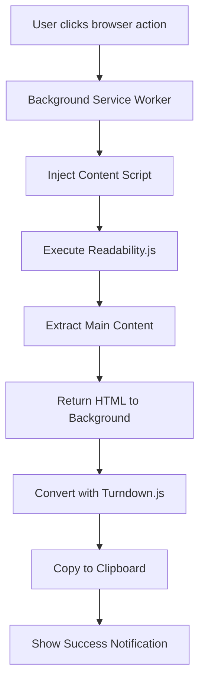

# Design Document

## Overview

The Markdown Page Extractor (Gloriosa) is a cross-browser extension that extracts the main content from web pages and converts it to Markdown format. The extension uses a Manifest V3 architecture with a background service worker that coordinates content extraction and clipboard operations.

The design leverages two established libraries:
- **Readability.js (v0.6.0)**: Extracts the main article content from web pages, removing clutter
- **Turndown.js (v7.2.1)**: Converts HTML to Markdown with proper formatting preservation

## Architecture

### High-Level Architecture



### Component Architecture

The extension follows a message-passing architecture between the background service worker and content scripts:

1. **Background Service Worker** (`gloriosa_background.js`)
   - Listens for browser action clicks
   - Coordinates the extraction workflow
   - Performs HTML-to-Markdown conversion
   - Handles clipboard operations
   - Manages error handling and user notifications

2. **Content Script** (injected dynamically)
   - Executes in the context of the active tab
   - Runs Readability.js on the page DOM
   - Extracts main content
   - Returns extracted HTML to background script

3. **Libraries**
   - Readability.js: Bundled and executed in content script context
   - Turndown.js: Bundled and executed in background service worker context

## Components and Interfaces

### 1. Manifest Configuration

**File**: `manifest.json`

**Key Configuration**:
```json
{
  "manifest_version": 3,
  "name": "Gloriosa",
  "version": "0.0.1",
  "description": "Get content in Markdown",
  "permissions": [
    "activeTab",
    "scripting",
    "clipboardWrite"
  ],
  "background": {
    "scripts": ["gloriosa_background.js"],
    "service_worker": "gloriosa_background.js"
  },
  "action": {
    "default_icon": "icons/icon_lightgray.png",
    "default_title": "Get content in Markdown"
  },
  "browser_specific_settings": {
    "gecko": {
      "id": "{generated-uuid}",
      "strict_min_version": "109.0"
    }
  }
}
```

**Design Decisions**:
- Use `activeTab` permission instead of broad host permissions for better privacy
- Use `scripting` permission for dynamic content script injection (Manifest V3 requirement)
- Use `clipboardWrite` for clipboard operations
- Remove `tabs` and `tabGroups` permissions as they're not needed
- Generate a proper UUID for Firefox compatibility
- Keep `background.scripts` entry for Firefox compatibility

### 2. Background Service Worker

**File**: `gloriosa_background.js`

**Responsibilities**:
- Listen for browser action clicks via `chrome.action.onClicked`
- Inject and execute content script with Readability.js
- Receive extracted HTML content from content script
- Convert HTML to Markdown using Turndown.js
- Write Markdown to clipboard
- Provide user feedback via notifications or badge text

**Interface**:
```javascript
// Message format from content script
{
  type: 'CONTENT_EXTRACTED',
  success: boolean,
  content: string | null,  // HTML content
  title: string | null,
  error: string | null
}

// Message format to content script
{
  type: 'EXTRACT_CONTENT'
}
```

**Key Functions**:
- `handleBrowserAction(tab)`: Entry point for browser action clicks
- `injectContentScript(tabId)`: Injects content script with libraries
- `convertToMarkdown(html, title)`: Converts HTML to Markdown
- `copyToClipboard(text)`: Writes text to clipboard
- `showNotification(message, isError)`: Provides user feedback

### 3. Content Script

**File**: `content.js` (injected dynamically)

**Responsibilities**:
- Execute Readability.js on the current page
- Extract main article content
- Send extracted content back to background script
- Handle extraction errors

**Key Functions**:
- `extractContent()`: Main extraction logic using Readability
- `sendResponse(data)`: Sends message back to background script

**Execution Context**:
- Runs in the page's DOM context
- Has access to `document` object
- Isolated from page scripts (Manifest V3 world: 'ISOLATED')

### 4. Library Integration

#### Readability.js Integration

**Usage Pattern**:
```javascript
// In content script
const documentClone = document.cloneNode(true);
const reader = new Readability(documentClone);
const article = reader.parse();

// article structure:
// {
//   title: string,
//   content: string (HTML),
//   textContent: string,
//   length: number,
//   excerpt: string,
//   byline: string,
//   dir: string,
//   siteName: string
// }
```

**Integration Method**:
- Bundle Readability.js with content script injection
- Execute in content script context where DOM is available
- Clone document before parsing to avoid modifying the page

#### Turndown.js Integration

**Usage Pattern**:
```javascript
// In background service worker
const turndownService = new TurndownService({
  headingStyle: 'atx',
  codeBlockStyle: 'fenced',
  bulletListMarker: '*'
});

const markdown = turndownService.turndown(html);
```

**Configuration Options**:
- `headingStyle: 'atx'`: Use `#` style headings
- `codeBlockStyle: 'fenced'`: Use `\`` for code blocks
- `bulletListMarker: '*'`: Use `*` for unordered lists
- `emDelimiter: '_'`: Use `_` for emphasis
- `strongDelimiter`: '**': Use `**` for strong emphasis
- `hr`: `---`: Use `---` for horizontal breaks

**Integration Method**:
- Import Turndown.js in background service worker
- Create service instance with configuration
- Process HTML content received from content script

## Data Models

### Article Data

```typescript
interface Article {
  title: string | null;
  content: string;  // HTML format
  textContent: string;
  length: number;
  excerpt: string | null;
  byline: string | null;
  dir: string | null;
  siteName: string | null;
}
```

### Extraction Result

```typescript
interface ExtractionResult {
  success: boolean;
  markdown: string | null;
  title: string | null;
  error: string | null;
}
```

### Message Protocol

```typescript
// Content Script -> Background
interface ContentMessage {
  type: 'CONTENT_EXTRACTED';
  success: boolean;
  content: string | null;  // HTML
  title: string | null;
  error: string | null;
}

// Background -> Content Script
interface BackgroundMessage {
  type: 'EXTRACT_CONTENT';
}
```

## Error Handling

### Error Categories

1. **Content Extraction Errors**
   - Page has no extractable content (Readability returns null)
   - DOM access errors
   - Script injection failures

2. **Conversion Errors**
   - Invalid HTML structure
   - Turndown conversion failures

3. **Clipboard Errors**
   - Clipboard API not available
   - Permission denied
   - Browser compatibility issues

### Error Handling Strategy

```javascript
// Graceful degradation pattern
try {
  // Attempt primary operation
  const result = await extractAndConvert();
  await copyToClipboard(result);
  showSuccess();
} catch (error) {
  // Log error for debugging
  console.error('Extraction failed:', error);
  
  // Provide user-friendly feedback
  if (error.type === 'NO_CONTENT') {
    showNotification('No readable content found on this page');
  } else if (error.type === 'CLIPBOARD_ERROR') {
    showNotification('Failed to copy to clipboard');
  } else {
    showNotification('An error occurred. Please try again.');
  }
}
```

### User Feedback Mechanisms

1. **Success State**
   - Badge text: "✓" or success icon
   - Optional notification: "Content copied to clipboard"
   - Badge clears after 2 seconds

2. **Error State**
   - Badge text: "✗" or error icon
   - Notification with specific error message
   - Badge clears after 3 seconds

3. **Loading State**
   - Badge text: "..." or loading indicator
   - Prevents multiple simultaneous extractions

## Testing Strategy

### Unit Testing

**Content Extraction Tests**:
- Test Readability.js with sample HTML documents
- Verify extraction of articles with various structures
- Test handling of pages with no extractable content
- Test handling of malformed HTML

**Markdown Conversion Tests**:
- Test Turndown.js with various HTML structures
- Verify preservation of headings, lists, links, images
- Test handling of tables and code blocks
- Test handling of nested structures

**Clipboard Tests**:
- Mock clipboard API
- Verify text is correctly formatted
- Test error handling for clipboard failures

### Integration Testing

**End-to-End Flow Tests**:
1. Simulate browser action click
2. Verify content script injection
3. Verify message passing
4. Verify clipboard operation
5. Verify user feedback

**Cross-Browser Tests**:
- Test on Firefox (with gecko-specific settings)
- Test on Chrome
- Test on Edge
- Verify Manifest V3 compatibility

### Manual Testing Scenarios

1. **Standard Article Page**
   - Navigate to a news article
   - Click browser action
   - Verify Markdown is copied
   - Paste and verify formatting

2. **Complex Page**
   - Test on page with ads, sidebars, navigation
   - Verify only main content is extracted
   - Verify clean Markdown output

3. **Edge Cases**
   - Test on page with no article content (e.g., search results)
   - Test on page with heavy JavaScript
   - Test on page with iframes
   - Test on page with special characters

4. **Error Scenarios**
   - Test on restricted pages (chrome://, about:)
   - Test with clipboard permissions denied
   - Test rapid successive clicks

### Test Data

Create sample HTML files for testing:
- `test/samples/simple-article.html`: Basic article structure
- `test/samples/complex-article.html`: Article with images, code, tables
- `test/samples/no-content.html`: Page with no extractable content
- `test/samples/malformed.html`: Page with malformed HTML

### Performance Testing

**Metrics to Monitor**:
- Time to extract content (should be < 500ms for typical pages)
- Time to convert to Markdown (should be < 200ms)
- Memory usage during extraction
- Extension bundle size (should be < 500KB)

**Performance Targets**:
- Total operation time: < 1 second for typical articles
- No memory leaks after repeated extractions
- Minimal impact on browser performance

## Security Considerations

1. **Permissions**
   - Use minimal permissions (activeTab instead of all_urls)
   - Request clipboardWrite only (not clipboardRead)
   - No network permissions needed

2. **Content Script Isolation**
   - Execute in isolated world (Manifest V3 default)
   - Don't expose extension APIs to page scripts
   - Clone document before processing to avoid page manipulation

3. **Data Handling**
   - Process content locally (no external API calls)
   - Don't store extracted content
   - Don't transmit data to external servers

4. **Input Validation**
   - Validate messages between background and content scripts
   - Sanitize HTML before processing (Readability handles this)
   - Handle malformed HTML gracefully

## Browser Compatibility

### Firefox-Specific Considerations
- Requires `browser_specific_settings.gecko.id` with UUID
- Minimum version: 109.0 (for Manifest V3 support)
- Use `browser` namespace (polyfilled to `chrome` by browser)
- Keep `background.scripts` entry in manifest.json for compatibility

### Chrome-Specific Considerations
- Service worker must be registered in manifest
- Use `chrome` namespace for APIs
- Minimum version: Chrome 88 (for Manifest V3 support)

### Cross-Browser API Usage
- Use `chrome.*` APIs (Firefox provides compatibility)
- Test both `chrome.action` and legacy `chrome.browserAction`
- Handle differences in clipboard API implementations

## Code Formatting Standards

All project files (except those in the `lib/` directory) must follow the formatting rules defined in `.editorconfig`:

### General Rules (All Files)
- **Charset**: UTF-8
- **Line Endings**: LF (Unix-style)
- **Indentation**: Tabs (default)
- **Final Newline**: Required
- **Trailing Whitespace**: Trimmed

### File-Specific Rules
- **JavaScript files** (`.js`): Tab indentation
- **JSON files** (`.json`): Tab indentation
- **Markdown files** (`.md`): Trailing whitespace preserved (for line breaks)

### Exceptions
- Files in `lib/` directory are pre-bundled third-party libraries and should not be modified to respect .editorconfig
- These libraries maintain their original formatting

### Implementation Notes
- All new files created during implementation must follow these standards
- Existing files should be updated to match these standards when modified
- Use editor plugins or IDE settings to automatically apply .editorconfig rules

## Deployment Considerations

### Build Process
- No build step required (vanilla JavaScript)
- Libraries are pre-bundled
- Direct deployment of source files

### Distribution
- Firefox: Submit to addons.mozilla.org

### Version Management
- Follow semantic versioning
- Update manifest version for each release
- Maintain changelog for user-facing changes

### File Structure
```
/
├── .editorconfig
├── manifest.json
├── gloriosa_background.js
├── content.js
├── lib/
│   ├── readability-0.6.0.js
│   └── turndown-7.2.1.js
├── icons/
│   ├── icon_gray.png
│   └── icon_lightgray.png
└── README.md
```
